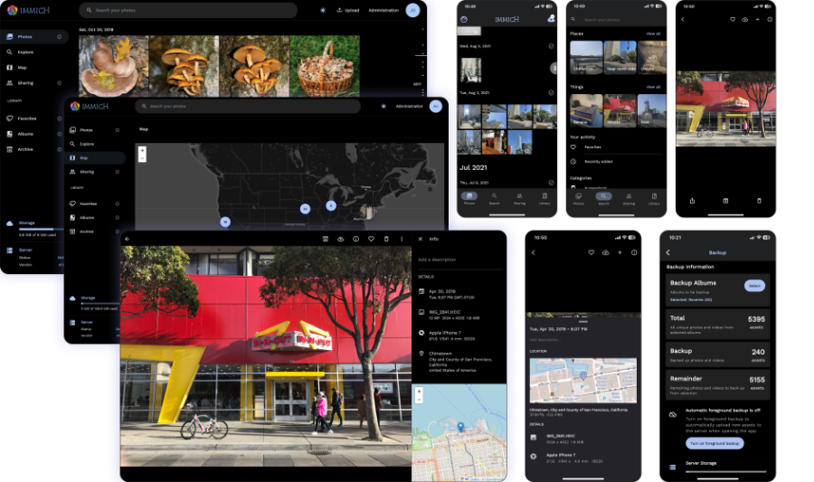

<!--
N.B.: This README was automatically generated by <https://github.com/YunoHost/apps/tree/master/tools/readme_generator>
It shall NOT be edited by hand.
-->

# Immich for YunoHost

[](https://dash.yunohost.org/appci/app/immich)  

[](https://install-app.yunohost.org/?app=immich)

*[Read this README in other languages.](./ALL_README.md)*

> *This package allows you to install Immich quickly and simply on a YunoHost server.*  
> *If you don't have YunoHost, please consult [the guide](https://yunohost.org/install) to learn how to install it.*

## Overview

Self-hosted photo and video management solution.

### Features

- Simple-to-use backup tool with a native mobile app that can view photos and videos efficiently ;
- Easy-to-use and friendly interface ;


**Shipped version:** 1.106.4~ynh1

## Screenshots



## :red_circle: Antifeatures

- **Alpha software**: Early development stage. May contain changing or unstable features, bugs, and security vulnerability.

## Documentation and resources

- Official app website: <https://immich.app>
- Official user documentation: <https://github.com/immich-app/immich#getting-started>
- Official admin documentation: <https://github.com/immich-app/immich#getting-started>
- Upstream app code repository: <https://github.com/immich-app/immich>
- YunoHost Store: <https://apps.yunohost.org/app/immich>
- Report a bug: <https://github.com/YunoHost-Apps/immich_ynh/issues>

## Developer info

Please send your pull request to the [`testing` branch](https://github.com/YunoHost-Apps/immich_ynh/tree/testing).

To try the `testing` branch, please proceed like that:

```bash
sudo yunohost app install https://github.com/YunoHost-Apps/immich_ynh/tree/testing --debug
or
sudo yunohost app upgrade immich -u https://github.com/YunoHost-Apps/immich_ynh/tree/testing --debug
```

**More info regarding app packaging:** <https://yunohost.org/packaging_apps>
