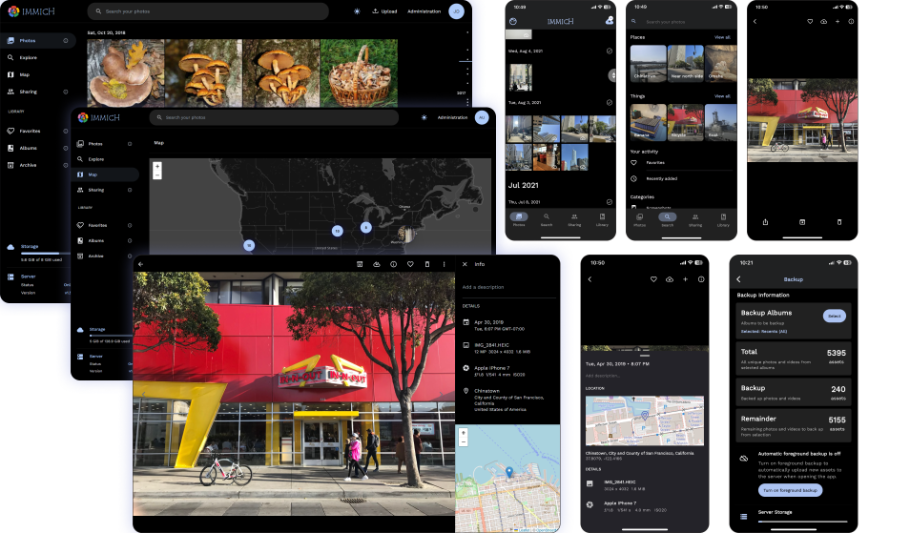

<!--
NOTA: Este README foi creado automáticamente por <https://github.com/YunoHost/apps/tree/master/tools/readme_generator>
NON debe editarse manualmente.
-->

# Immich para YunoHost

[](https://dash.yunohost.org/appci/app/immich)  

[](https://install-app.yunohost.org/?app=immich)

*[Le este README en outros idiomas.](./ALL_README.md)*

> *Este paquete permíteche instalar Immich de xeito rápido e doado nun servidor YunoHost.*  
> *Se non usas YunoHost, le a [documentación](https://yunohost.org/install) para saber como instalalo.*

## Vista xeral

Self-hosted photo and video management solution.

### Features

- Simple-to-use backup tool with a native mobile app that can view photos and videos efficiently ;
- Easy-to-use and friendly interface ;


**Versión proporcionada:** 1.106.4~ynh1

## Capturas de pantalla



## :red_circle: Debes considerar

- **Alpha software**: Early development stage. May contain changing or unstable features, bugs, and security vulnerability.

## Documentación e recursos

- Web oficial da app: <https://immich.app>
- Documentación oficial para usuarias: <https://github.com/immich-app/immich#getting-started>
- Documentación oficial para admin: <https://github.com/immich-app/immich#getting-started>
- Repositorio de orixe do código: <https://github.com/immich-app/immich>
- Tenda YunoHost: <https://apps.yunohost.org/app/immich>
- Informar dun problema: <https://github.com/YunoHost-Apps/immich_ynh/issues>

## Info de desenvolvemento

Envía a túa colaboración á [rama `testing`](https://github.com/YunoHost-Apps/immich_ynh/tree/testing).

Para probar a rama `testing`, procede deste xeito:

```bash
sudo yunohost app install https://github.com/YunoHost-Apps/immich_ynh/tree/testing --debug
ou
sudo yunohost app upgrade immich -u https://github.com/YunoHost-Apps/immich_ynh/tree/testing --debug
```

**Máis info sobre o empaquetado da app:** <https://yunohost.org/packaging_apps>
